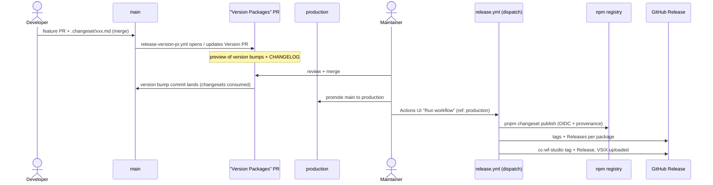
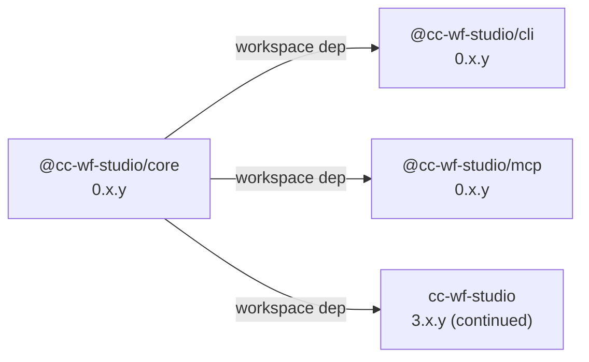

# Release Flow

This repository uses **[Changesets](https://github.com/changesets/changesets)** for versioning across the pnpm workspace. Publishing is a **manual GitHub Actions dispatch** that runs from the **`production`** branch.

## TL;DR for contributors

1. Open a feature/fix PR against `main`.
2. If your change affects a published package, run `pnpm changeset` locally and commit the generated `.changeset/<name>.md`. (Docs/chore-only PRs: `pnpm changeset add --empty`.)
3. Check the **changeset-bot** comment on your PR — 🦋 means a changeset was detected, ⚠️ means none was found. If you see ⚠️ and the PR should release something, add the missing changeset; if it intentionally has no release, add an empty one to clear the warning.
4. Merge your PR. The `release-version-pr.yml` workflow opens / updates a `chore(release): version packages` PR collecting all pending changesets (this is a **preview** — version bumps + CHANGELOG diff; nothing is published yet).
5. When ready to release, merge that "Version Packages" PR into `main`, then promote `main` → `production`.
6. A maintainer runs the **"Release — Publish"** workflow from the Actions UI (ref defaults to `production`). It publishes the npm packages and uploads the VSIX for `cc-wf-studio`.

## Branch model

- `main` — the development + version-staging branch. Feature work branches off `main` and merges back via PR. The "Version Packages" PR also lands here.
- `production` — the release source. `main` is promoted to `production` (push or PR) when a release is intended. Publishing always reads from `production`, so `production` is a snapshot of "what is released".

## Two workflows

| Workflow | Trigger | Does |
|---|---|---|
| `.github/workflows/release-version-pr.yml` | push to `main` | Runs `changesets/action` **version step only** — opens / updates the "Version Packages" PR. No publish. |
| `.github/workflows/release.yml` | **`workflow_dispatch`** (input `ref`, default `production`) | Builds, runs `changesets/action` **publish step** (`pnpm changeset publish`) over npm OIDC, then detects the `cc-wf-studio@*` tag and uploads the VSIX. |

## What each package looks like at release

| Package | npm | Tag | VSIX attached |
|---|---|---|---|
| `@cc-wf-studio/core` | ✅ public | `@cc-wf-studio/core@x.y.z` | — |
| `@cc-wf-studio/cli` | ✅ public | `@cc-wf-studio/cli@x.y.z` | — |
| `@cc-wf-studio/mcp` | ✅ public | `@cc-wf-studio/mcp@x.y.z` | — |
| `cc-wf-studio` (VSCode extension) | ❌ private | `cc-wf-studio@x.y.z` | ✅ `cc-wf-studio-x.y.z.vsix` |

`cc-wf-studio` is `"private": true`, so Changesets versions and tags it but does not push it to npm. The workflow detects the tag, builds the VSIX, and attaches it to the GitHub Release.

`cc-wf-studio-webview` is in the Changesets `ignore` list — it is bundled into `@cc-wf-studio/cli` and the extension at build time, never published on its own.

## End-to-end flow



## npm authentication: OIDC Trusted Publishing

npm publishes use **OIDC Trusted Publishing** — there is **no `NPM_TOKEN` secret**. Each of `@cc-wf-studio/{core,mcp,cli}` has a Trusted Publisher configured on npmjs.com pointing at `breaking-brake/cc-wf-studio` → `release.yml`. The publish workflow sets `NPM_CONFIG_PROVENANCE: 'true'`, so each release carries a provenance attestation visible on npmjs.com.

## VS Marketplace / Open VSX (manual)

The workflow does **not** push the extension to the Marketplace. It only builds the `.vsix` and attaches it to the `cc-wf-studio@x.y.z` GitHub Release. The store publish is manual:

1. "Release — Publish" uploads `packages/vscode/*.vsix` to the GitHub Release.
2. The Repository Owner downloads that `.vsix`.
3. The Repository Owner uploads it to the VS Marketplace (and Open VSX) via the publisher portal.

So the GitHub Release `.vsix` is the source artifact for the store listing — there is no `vsce publish` / `ovsx publish` in CI.

## Independent versions + internal dependency propagation

Each workspace package is versioned independently — there is no `fixed` or `linked` group in `.changeset/config.json`.



- `cc-wf-studio` keeps its existing 3.34.x stream so the Marketplace listing stays continuous. A `cc-wf-studio@3.34.1` tag seeds that history.
- New packages start at pre-1.0 (`core@0.1.0`, `mcp@0.1.1`, `cli@0.1.1` as of writing).
- `updateInternalDependencies: "patch"` is set, so bumping `@cc-wf-studio/core` automatically bumps `cli` / `mcp` (patch) and updates their dependency ranges — no separate changeset needed for the dependents.
- `workspace:*` dependencies are replaced with the actual published versions when `changeset publish` runs.

## Required secrets

| Secret | Purpose |
|---|---|
| `RELEASE_BOT_APP_ID` | GitHub App ID used to author release commits / PRs as a bot. |
| `RELEASE_BOT_PRIVATE_KEY` | Private key for the above GitHub App. |

No `NPM_TOKEN` — npm publishing is via OIDC Trusted Publishing.

## Authoring a changeset

```bash
pnpm changeset
```

The interactive prompt asks: which packages changed, the bump level (`patch` / `minor` / `major`), and a summary used for the CHANGELOG entry. Commit the generated file alongside your code. You never hand-edit `CHANGELOG.md` — Changesets generates it.

### Changeset bot

The [changeset-bot](https://github.com/apps/changeset-bot) GitHub App is installed on this repository. It comments on every PR to show whether a changeset is present:

- **🦋 Changeset detected** — the PR adds a `.changeset/*.md` file (a real bump or an empty one).
- **⚠️ No Changeset found** — the PR adds none. This is a *reminder, not a blocker* — merging is still allowed. If the PR genuinely needs no release, add an empty changeset (`pnpm changeset add --empty`) to make the intent explicit and clear the warning.

There is no hard CI gate that fails the build on a missing changeset; the bot comment plus the human review at the "Version Packages" PR are the safety net.

## What doesn't trigger a release

- Pushes to branches other than `main` (the version-PR workflow only watches `main`).
- A "Version Packages" PR merge **does not publish** on its own — publishing is the separate manual dispatch from `production`.
- Merges with no `.changeset/*.md` (no version bump → no Version PR).
- Pure docs / chore PRs where you intentionally add an empty changeset.

## Prior release flows (for reference)

- **Original**: `semantic-release` on push to `production` (commit-message driven), with auto-sync `production` → `main`.
- **Brief interlude**: per-package `semantic-release` with `semantic-release-monorepo` on a `workflow_dispatch` (Phase 8). Reverted because Changesets handles internal dependency propagation and CHANGELOG generation more cleanly for this monorepo.

The current flow (Changesets + manual publish dispatch from `production` + OIDC) supersedes both.
